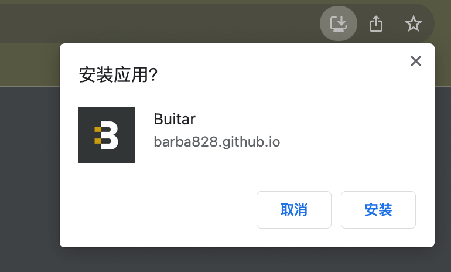
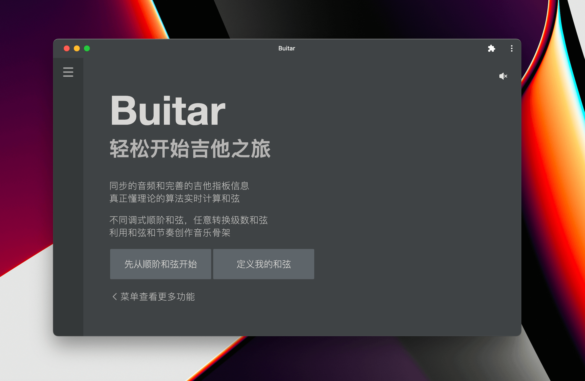
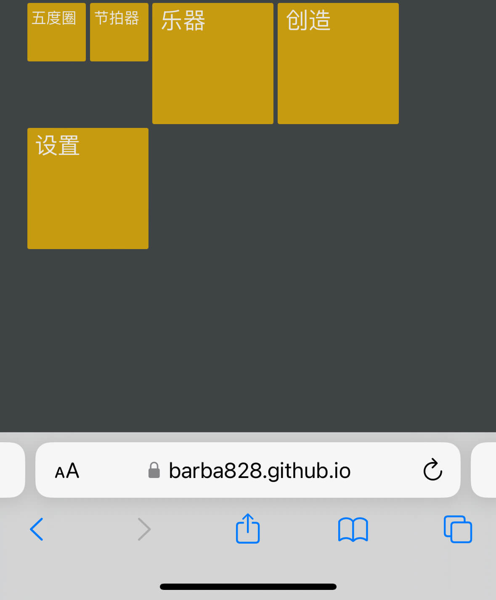
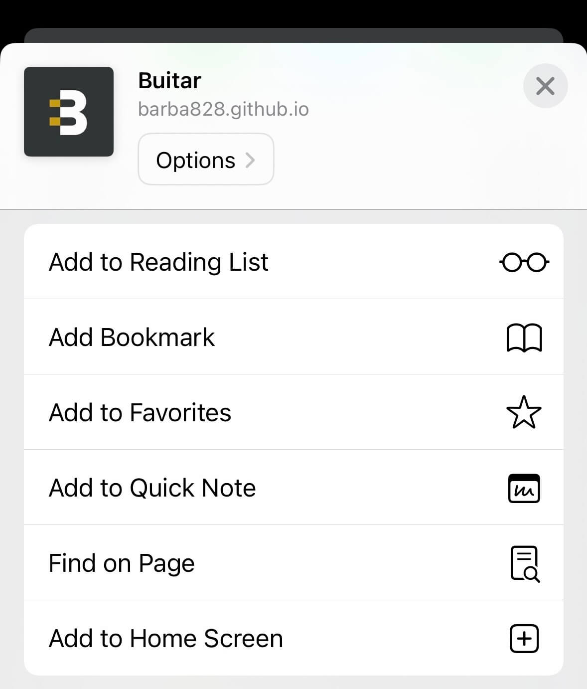
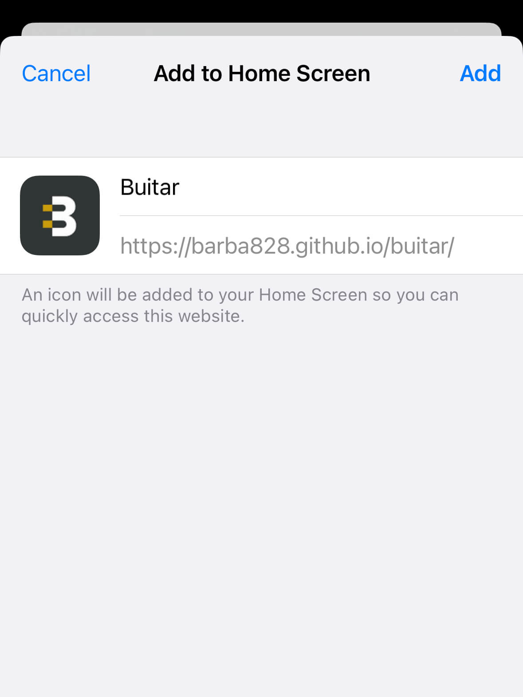
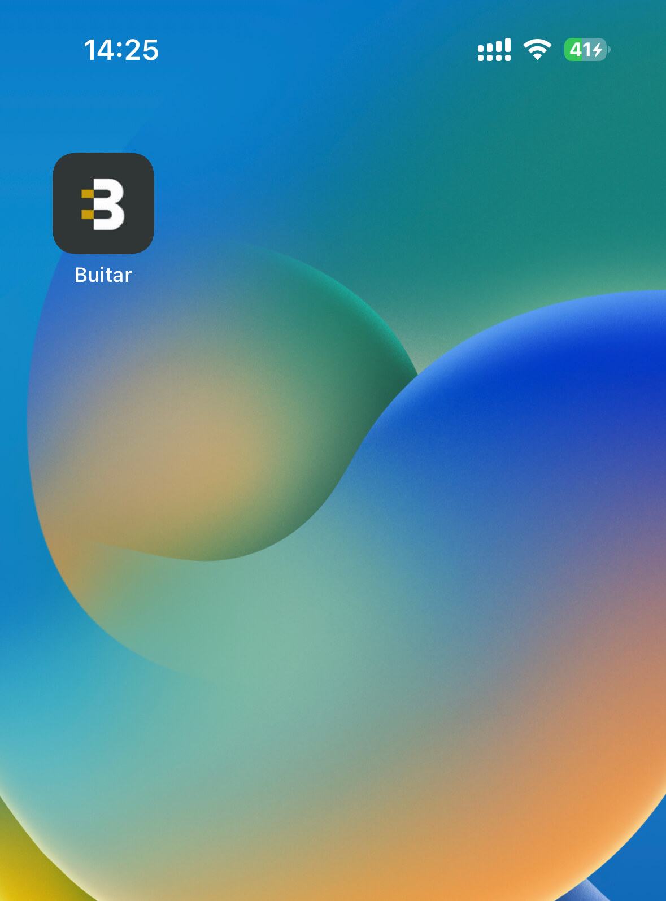
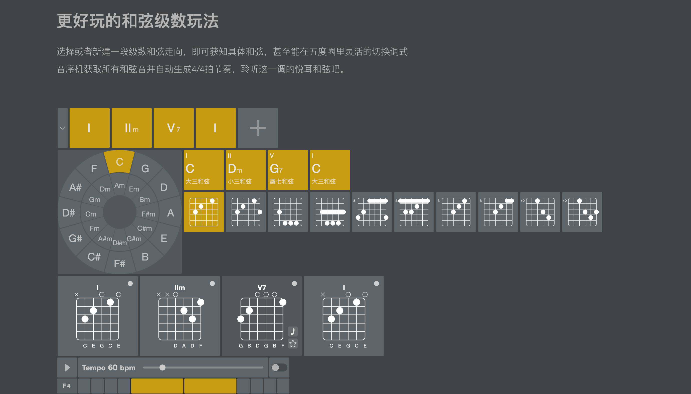
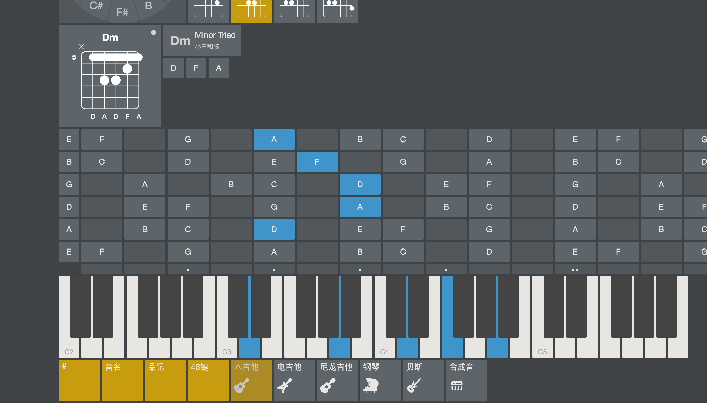
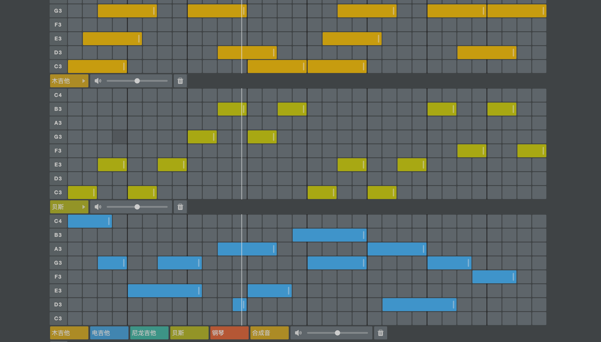

# Buitar


[English Docs](./docs/README_en.md)

**Buitar**，一个基于[tone.js](https://github.com/Tonejs/Tone.js)控制器乐，React绘制UI的吉他学习工具

## 前往体验
可以选择前往[GitHub Pages](https://barba828.github.io/buitar/)，或者[Vercel](https://buitar.vercel.app/)

- 完善的和弦学习工具集，基于配置即时生成和弦指位图
- 完备的乐器搭配，随意切换弦乐乐器
- 自由搭配的和弦进行，可以在五度圈上任意切换
- 灵活使用的吉他指板/键盘指板
- 趣味无限的音序机

### 弦乐
参考[tonejs-instruments](https://github.com/nbrosowsky/tonejs-instruments)
- 原声吉他
- 尼龙吉他
- 电吉他
- 贝斯
- 钢琴
- 尤克里里

### 打击乐
- 套鼓
- 原生鼓
- 电子鼓
- 节拍器

## PWA支持（推荐使用）

1. 如果你使用的是Chrome，那你应该注意到打开页面时弹出的安装到本地的标记（PC｜移动端同理）

     | 
    ---|--- 
    点击安装到桌面 | 桌面打开应用

2. 如果你使用的Safari，可以点击安装到桌面（移动端）
     |  |  | 
    ---|---|---|---
    点击底部分享按钮 | 点击添加到桌面(Home Screen) | 确认添加 | 桌面打开应用


预览截图




## 关于

我一直饱受吉他和弦转换等吉他乐理知识的困扰，当然，我也曾经在网上看到过一些吉他学习工具，但是我觉得这些工具有一点多和杂乱，打算自己搞一套工具集。同时也再次学习了吉他乐理知识，包括五度圈、十二平均律、和声系统...以及一些对 Web Audio 的探索。

关于功能和乐理仍有很多不足，欢迎提 Issue，我会尽快完善。


## 开发

```sh
pnpm install

# 构建
pnpm build

# 本地开发(localhost:8282)
pnpm dev
```

## [TODO](./packages/buitar/README.md)