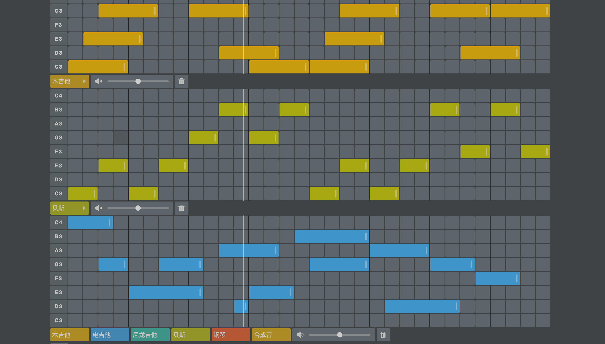

# Buitar

[中文介绍](./README_zh.md)

Welcone to Buitar! A guitar and chord leaning tool based on [tone.js](https://github.com/Tonejs/Tone.js).

So [Enjoy it!](https://barba828.github.io/buitar/) on Github Pages: https://barba828.github.io/buitar/

- Complete chord learning toolset
- Complete instrument set
- Freely matched chord progressions
- Flexible guitar fretboard/keyboard
- Fun sequencer

And the instruments used in it refer to [tonejs-instruments](https://github.com/nbrosowsky/tonejs-instruments)

- acoustic guitar
- nylon guitar
- electric guitar
- electric bass
- piano

## PWA Support
1. if you're using Chrome, you should notice the install local popup when you open the page.
2. if you're using Safari, just click “Add to Home Screen” for better.

- if you

And preview screenshots

## About

I have always been troubled by the knowledge of guitar music theory such as guitar chord conversion. Of course, I have also seen some guitar learning tools on the Internet, but I think these tools are a bit too many and messy, and finally I plan to make one by myself during the epidemic prevention days at home. Set of tools. At the same time, I also learned the knowledge of guitar music theory again, including the circle of fifths, the twelve equal temperament, the harmony system... and some Web Audio exploration.

In fact, there are still many deficiencies in the function and music theory. You are welcome to make comments and suggestions. I will improve it as soon as possible.

Finally, I have to continue to practice the guitar. I like to practice the fingerstyle of Oshio Kotaro and Kishibe Maaki. Finally, when will I be able to play jazz?

If you have any questions or ideas, please submit your issue
