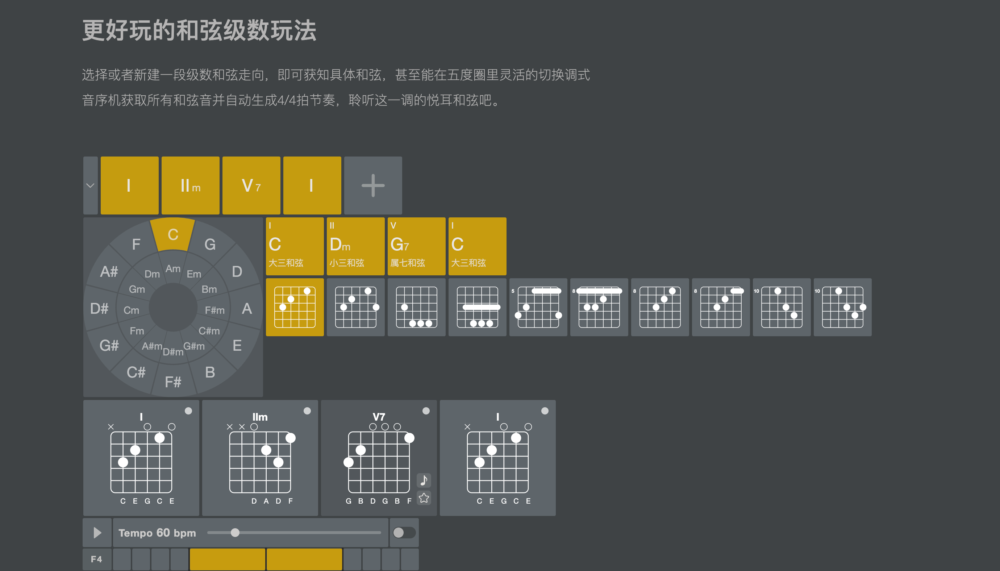

# Buitar


基于[to-guitar.js](https://github.com/Barba828/to-guitar)和[tone.js](https://github.com/Tonejs/Tone.js)的吉他学习工具

[前往网址](https://barba828.github.io/buitar/)

- 完善的和弦学习工具集
- 完备的乐器搭配
- 自由搭配的和弦进行
- 灵活使用的吉他指板/键盘指板
- 趣味无限的音序机

使用的乐器参考[tonejs-instruments](https://github.com/nbrosowsky/tonejs-instruments)

- 原声吉他
- 尼龙吉他
- 电吉他
- 贝斯
- 钢琴

预览截图



## 关于

我一直饱受吉他和弦转换等吉他乐理知识的困扰，当然，我也曾经在网上看到过一些吉他学习工具，但是我觉得这些工具有一点多和杂乱，终于在防疫居家的日子打算自己搞一套工具集。同时也再次学习了吉他乐理知识，包括五度圈、十二平均律、和声系统...以及一些 Web Audio 的探索。

事实上，关于功能和乐理仍有很多不足，欢迎大家提意见和建议，我会尽快完善。

最后，还得继续练吉他啊，很喜欢练押尾光太郎和岸部真明的指弹，最后的最后，啥时候我才能弹爵士啊

欢迎提 Issue

## ToDo

- 收藏
- 节奏型
- 节拍器

## 开发

```sh
yarn

# 本地开发
yarn dev

# 构建
yarn build

# 构建github page
yarn build:docs
```
